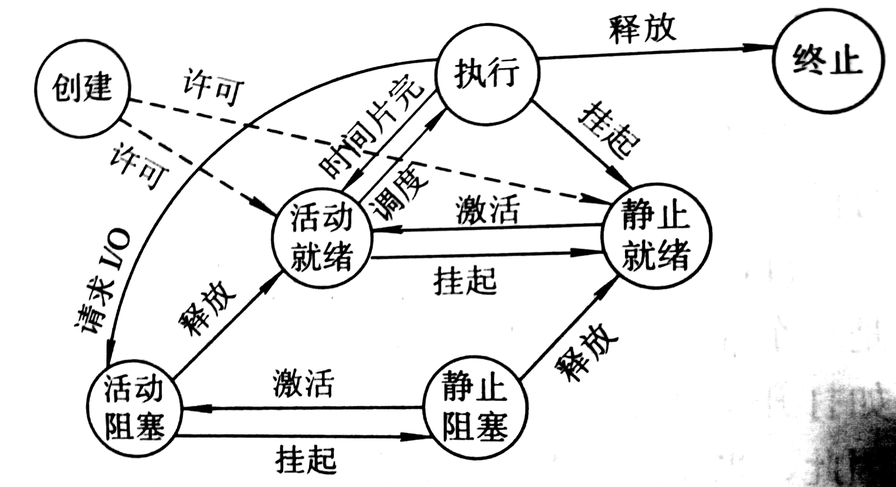

# 进程

进程是进程实体的运行过程，是系统进行资源分配和调度的一个独立运行单位。进程实体由程序段、相关数据段和一个专门数据结构——进程控制块（Process Control Block，PCB）组成，一般情况下，进程实体简称进程。

引入进程是为了实现多程序的并发执行。在引入进程之前，程序并发运行结果不可再现。而进程切换时能够保存现场信息到 PCB 中，待下次调度执行时可从 PCB 中恢复 CPU 现场而继续执行，从而实现并发运行。

引入进程，虽然 PCB 和进程协调机制占用更多内存，进程间的切换、同步和通信等需要更多时间，但多程序并发执行极大提高了资源利用率和系统吞吐量。

同一个程序一次执行可产生多个进程，统一程序多次运行将分别形成不同的进程，而进程在生命周期的不同时段可执行不同的进程。

## 进程控制块

OS 对每个资源和进程都设置了一个数据结构——资源信息表或进程信息表，用于表征其实体。这些信息表可分为四类：内存表、设备表、文件表和用于进程管理的进程表，其中进程表就是 PCB。

PCB 主要有四方面信息：

- 进程标识符：外部标识符用于用户访问进程（包括描述进程家族关系）；内部标识符用于系统使用，是唯一编码。
- 处理机状态信息：由处理机各寄存器中的内容组成，包括通用寄存器（用户程序可访问）、指令计数器、程序状态字、用户栈指针。
- 进程调度信息：包括进程状态、进程优先级、进程调度所需的其他信息（用于进程调度算法，例如等待时间）、事件（阻塞原因）。
- 进程控制信息：包括程序和数据地址、进程同步和通信机制、资源清单（所需全部资源清单和已分配到资源清单）、链接指针（指向进程所在队列下一个进程的 PCB 首地址）。

PCB 的常用组织方式有三种：

- 线性方式：所有 PCB 存在一张线性表中
- 链接方式：把具有相同状态进程的 PCB 分别通过 PCB 的链接字链接成一个队列
- 索引方式：根据进程状态不同建立几张索引表，并把各索引表的首地址记录在内存的一些专用单元中

## OS 内核

现代操作系统一般将 OS 划分为若干层次，再将 OS 的不同功能分别设置在不同的层次中。通常将一些与硬件紧密相关的模块（如中断处理程序）、各种常用设备的驱动程序以及运行频率较高的模块（如时钟管理、进程调度）安排在紧靠硬件的软件层次，常驻内存，它们被称为 OS 内核。

相应的，为保护 OS 内核，将处理机的执行状态分为系统态（内核态）和用户态。内核态能执行一切指令，访问所有寄存器和存储区。用户态权限有限，一般应用程序只能在用户态运行，不能执行 OS 指令和访问 OS 区域。

不同类型和规模的 OS，内核功能有所差异，但都包含两大功能：

- 支撑功能：最基本的支撑功能是中断处理、时钟管理和原语操作。
- 资源管理功能：包括进程管理、存储器管理和设备管理

## 进程控制

进程控制是进程管理最基本的功能，主要包括创建新进程、终止以完成进程、将因发生异常而无法继续运行的进程置于阻塞状态、负责进程运行过程中的状态转换功能等，一般有 OS 内核中的原语来实现。

在 OS 中，一个进程可以创建另一个进程，分别称作父进程和子进程。子进程可继承父进程所拥有的资源，子进程被撤销时要归还资源给父进程；而父进程被撤销时，也必须撤销其所有的子进程。

导致进程创建的主要事件有：

- 系统初始化（用户登录）
- 正在运行的程序执行了创建进程的系统调用
- 用户请求创建一个新进程
- 一个批处理作业的初始化

导致进程终止的主要事件有：

- 正常退出（自愿）：完成工作而终止
- 出错退出（自愿）：进程发现了严重错误，例如越界错误、运行超时
- 严重错误（非自愿）：进程引起的错误，例如除以0
- 被其他进程杀死（非自愿）：例如系统锁死

导致阻塞（原语 block）和唤醒（原语 wakeup）的事件有：

- 向系统请求共享资源（例如打印机）失败，后又有足够资源空余
- 等待某种操作完成，例如 I/O 操作
- 新数据尚未到达
- 等待新任务到达，例如邮件接收

当一进程被挂起操作（Suspend 原语）时，该进程进入静止状态（执行状态进程暂停执行、就绪状态进程暂不接受调度），与挂起对应的操作是激活操作（Active 原语）。

引入挂起操作的原因：

- 终端用户需要：终端用户希望暂停自己的程序一遍查看和修改
- 父进程请求：父进程希望查看和修改子进程或协调子进程间的活动
- 负荷调节需要：当实时系统工作负荷过重时，需要挂起不重要的进程
- OS 需要：OS 希望检查运行中的资源使用情况和进行记账

## 进程状态

- 就绪（Ready）状态：进程已分配到除 CPU 以外的所有资源，在就绪队列等待执行。
-  执行（Running）状态：正在执行（一个处理机只有一个进程处于执行状态）。
- 阻塞（Block）状态：正在执行的进程由于发生外部事件暂时无法继续执行，排入阻塞队列，此时 OS 把处理机分配给一个就绪进程。
- 创建（Creating）状态：进程创建有四个步骤（申请空白 PCB、向 PCB 写入由于控制和管理进程的信息、分配运行所必须的资源、转为就绪状态插入到就绪队列中），引入创建状态是为了保证进程的调度在创建完成之后。
- 终止（termination）状态：进程终止也有两个步骤（等待 OS 善后处理、PCB 清零），善后处理即其他进程提取该进程在进入终止状态后保存的状态码和一些计时统计数据。

引入挂起操作、激活操作后的进程状态如下（当 OS 不给分配新建进程所需的主存时，进程被安置在外存，即禁止就绪状态）

##  ChangeLog

> 2018.08.17 进程状态
>
> 2018.08.18 进程控制、初稿