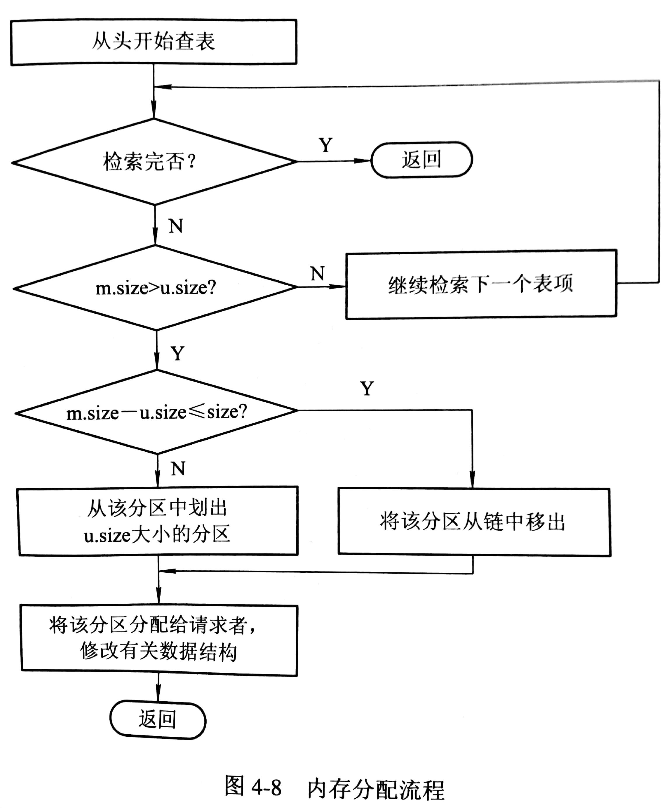
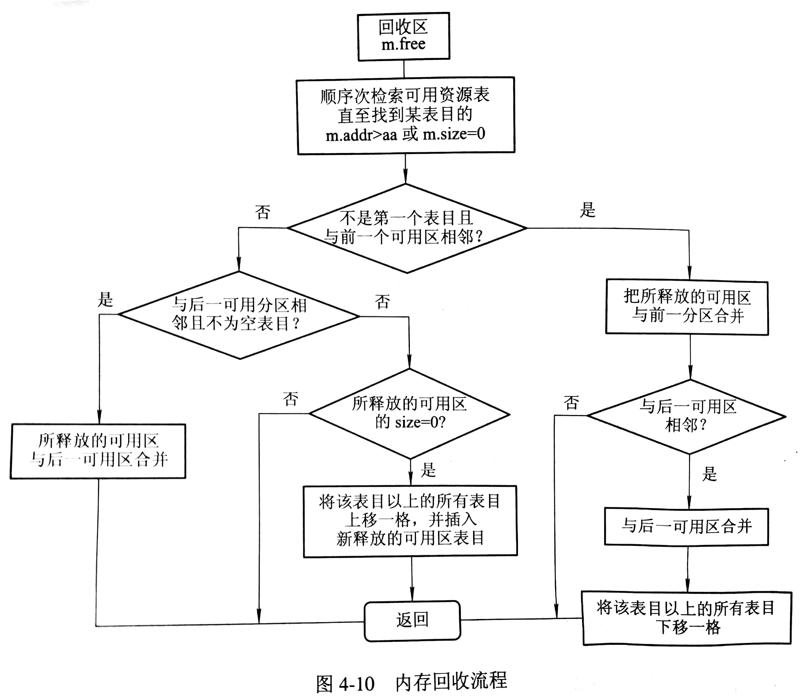
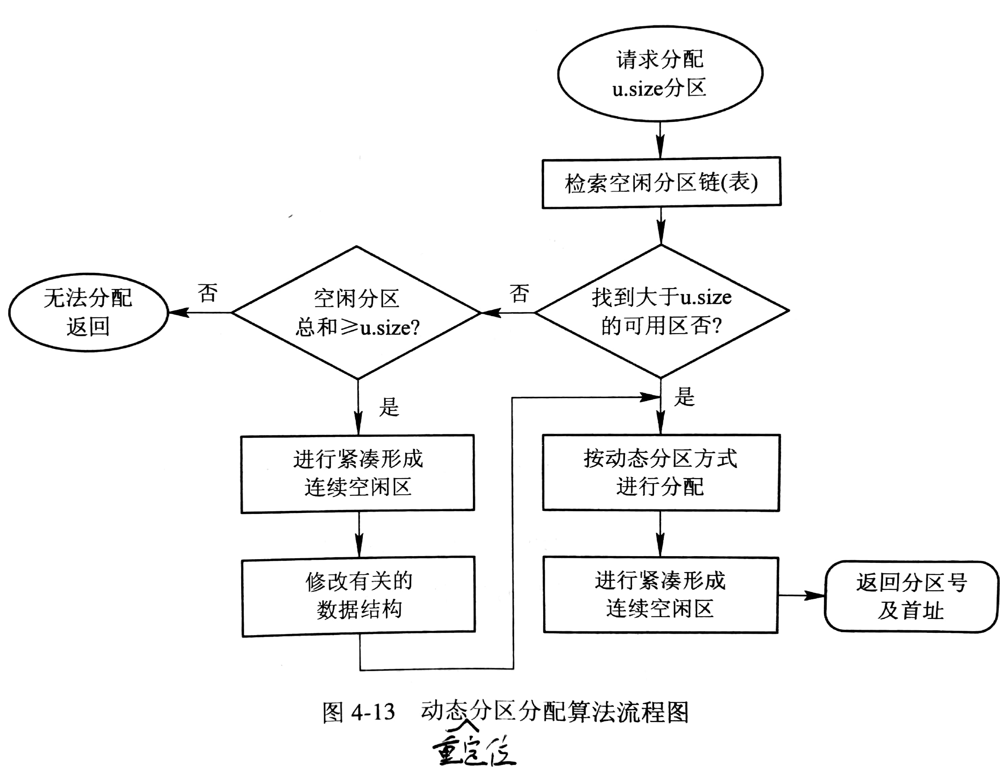

# 连续分配存储管理方式

## 单一连续分配

用户区内存仅装有一道用户程序。

## 固定分区分配

将内存的用户空间划分为若干个固定大小（可以相等也可以不等）的分区，按分区大小对其排序。并建立一张分区使用表（表项包括分区起始地址、大小和状态）。

## 动态分区分配

### 动态分区分配的数据结构

常用的数据结构有两种

- 空闲分区表：系统设置一张空闲分区表用于记录每个空闲分区的情况，表项包括分区号、大小、和起始地址等。
- 空闲表链：系统设置一个双向链，在头尾都记录状态和分区大小。

### 分区分配操作

#### 分配内存

{: width="100px" height="100px"}

#### 回收内存

{: width="100px" height="100px"}

### 基于顺序搜索的动态分区分配算法

- 首次适应（first fit，FF）算法：空闲分区链以地址递增的次序链接，内存分配时，从链首开始顺序查找，将第一个满足内存大小的分区划分内存给进程，余下空闲分区仍留在空闲链中；否则内存分配失败。
- 循环首次适应（next fit，NF）算法： 内存分配时从上一次找到空闲分区的位置开始查找，其余与 FF 一致。
- 最佳适应（best fit，BF）算法：空闲分区按容量从小到大排序，再实施 FF。
- 最坏适应（worst fit，WF）算法：空闲分区按容量从大到小排序，若第一个分区满足进程内存需求，则分配内存；否则分配失败。

### 基于索引搜索的动态分区分配算法

#### 快速适应（quick fit，QF）算法（分类搜索法）

对每一类具有相同容量的所有空闲分区，单独设立一个空闲分区链表，同时在内存中设立一张管理索引表，每个索引项对应一种空闲分区类型，并记录该类型空闲分区链表表头指针。分配空闲分区时，从索引表中找到最小且满足进程内存需求的空闲分区链表，从链表中取下第一块分配给进程。

#### 伙伴系统（buddy system）

规定内存分区大小为 $$2^k,(1 \leq k \leq m)$$ ，$$2^m$$ 为整个分配内存大小。对于一个大小为 $$2^k$$ ，地址为 x的内存块，其伙伴地址为 $$x \pm x^k$$ ，符号取决于 $$x \ mod \  2^{k+1}$$ 。对每一类具有相同容量的所有空闲分区，单独设立一个空闲分区链表。在分配内存时，计算内存需求适合（满足且最小）的内存分区，在对应大小的空闲表链开始查找。未找到则在更一级的空闲分区表链查找，找到后将空闲分区分割，将适合的一块空闲分区分配给进程。回收时需要合并空闲的伙伴分区。

#### 哈希算法

即利用哈希快速查找实现最佳分配策略。根据空闲分区在可利用空闲区表中的分布规律建立哈希函数，构造一张以空闲分区大小为关键字的哈希表，每个表项纪录一个对应的空闲分区链表表头指针。

## 动态可重定位分区分配

紧凑的方法是通过移动内存中作业的位置，把原来分散的小分区拼接成一个大的分区，需要修改程序和数据的地址。

而动态重定位则在程序指令真正执行时，才将逻辑地址转换为物理地址（即逻辑地址与重定位寄存器中的地址相加）。当系统对内存进行「紧凑」时，仅需将若干程序的内存移至另一处，无需修改程序。

### 动态可重定位分区分配算法

{: width="100px" height="100px"}

## ChangeLog

> 2018.09.01 初稿