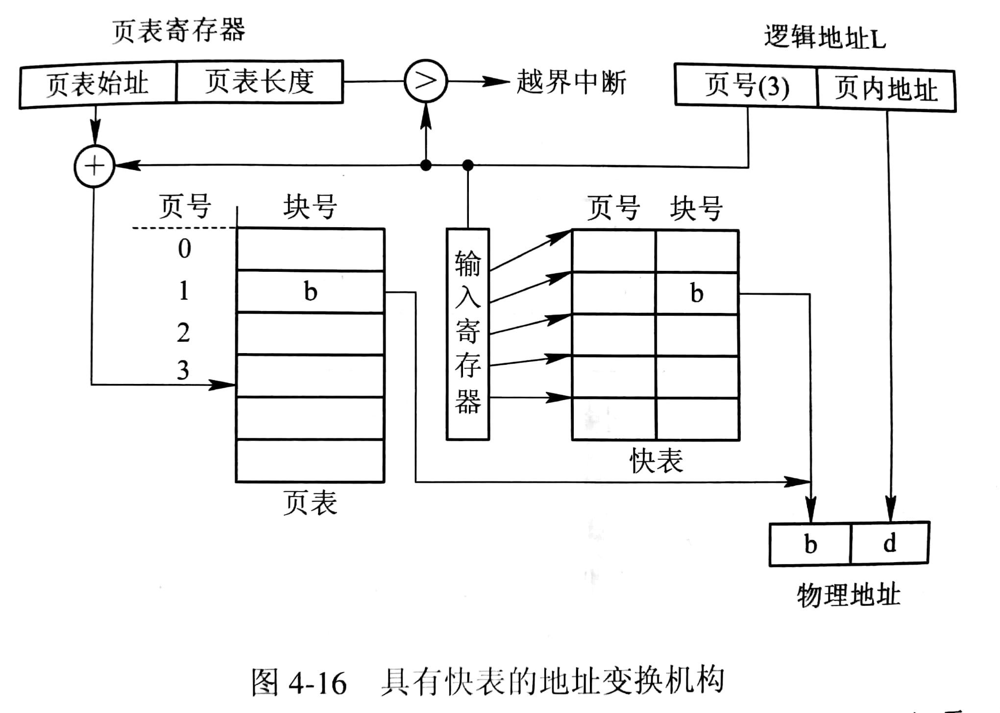
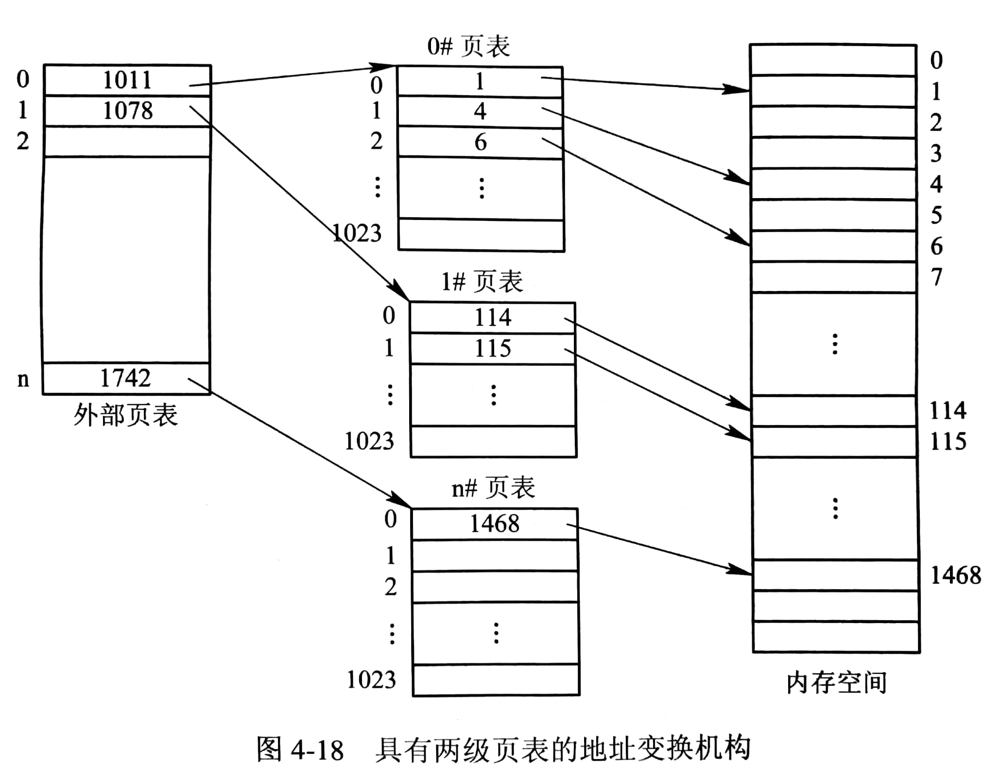

# 分页存储管理方式

## 分页存储管理的基本方法

### 页面

#### 页面与物理块

分页存储管理将进程的逻辑地址分为大小相等的页，将内存的物理地址空间分成与页相同大小的块，因此页内地址与物理块内地址一一对应。系统在为进程分配内存时，将进程的各个页分别装入多个可以不相邻的物理块中。页面大小通常为 1KB~8KB.

分页地址的逻辑地址结构：`| （12~32位）页号 P | （0~11位） 位移量 W（即业内地址d）|`

### 页表与地址表换机构

#### 页表

页表的基本功能是将页号映射到物理块号，也可在在页表的表项中设置存取控制字段（例如1位的读写、只读控制）。

#### 基本的地址变换机构

页表功能是由一组专门的寄存器来实现的，一个页表项用一个寄存器。页表大多驻留在内存中，系统只设置一个页表寄存器（Page-Table Register），存放从进程 PCB 获取的页表在内存的始址和页表长度。

进程访问某逻辑地址时，分页地址变换机构将有效地址分为页号和页内地址，以页号为索引去检索页表（由硬件完成）。页号先与页表长度比较，未越界则将页表始址与页号和页表项长度之积相加，得到该表项在页表中的位置，从而得到物理块号；否则产生地址越界中断。物理块号与页面地址相连即为物理地址。

#### 具有快表的地址变换机构

为提高地址变换速度，可在地址变换机构增设一个具有并行查寻能力的特殊高速缓冲寄存器（又称联想寄存器或快表），用以存放当前访问的那些表项。

快表表项的结构为：`| 页号 | 块号 |`

### 访问内存的有效时间

有效访问时间（Effective Access Time）指从进程发出指定逻辑地址的访问请求，经过地址变换，到在内存中找到对应的实际物理地址单元并取出数据的时间总和。

假设一次访存时间为 t，查找快表时间为 q，快表命中率为 a，则

- 基本的地址变换机构的有效时间是 2t
- 具有快表的地址变换机构的有效时间是 2t+p-at

## 两级或多级页表

逻辑地址大（例如32位）的分页系统，每个进程页表的页表项数会很多（假设页面大小不变），需要采用多级页表，分散存储页表（仅部分调入内存）。

### 两级页表

两级页表的逻辑地址结构：`| 外层页号 P1 | 外层页内地址 P2 | 页内地址 d |`

在原来一级页表地址变换机构的基础上，需要新增一外部页表（以 P1为索引）、一外层页表寄存器（存放外存页表始址）。

对于正在运行的进程，其外层页表需调入内存，其页表则只需调入几页，在外层页表增设一状态位（用以表示页表是否调入内存）。

## 反置页表

通常系统允许一个进程的逻辑地址空间很大，因此页表项很多，占用内存很大。为减少页表占用内存空间，引入反置页表。

### 页表

反置页表为每一个物理块设置一个页表项，并将它们按物理块的编号排序，其中的内容是页号和其所隶属进程的标识符。

### 地址变换

反置页表进行地址变换是根据进程标识符和页号检索反置页表，若匹配，则页表项的序号即为物理块号；否则表明此页为调入内存。

反置页表也可采用两级页表，外部页表与传统页表页表一样，其表项是每个也在外存的物理地址，通过外部页表也将所需页面调入内存。

## ChangeLog

> 2018.09.12 初稿