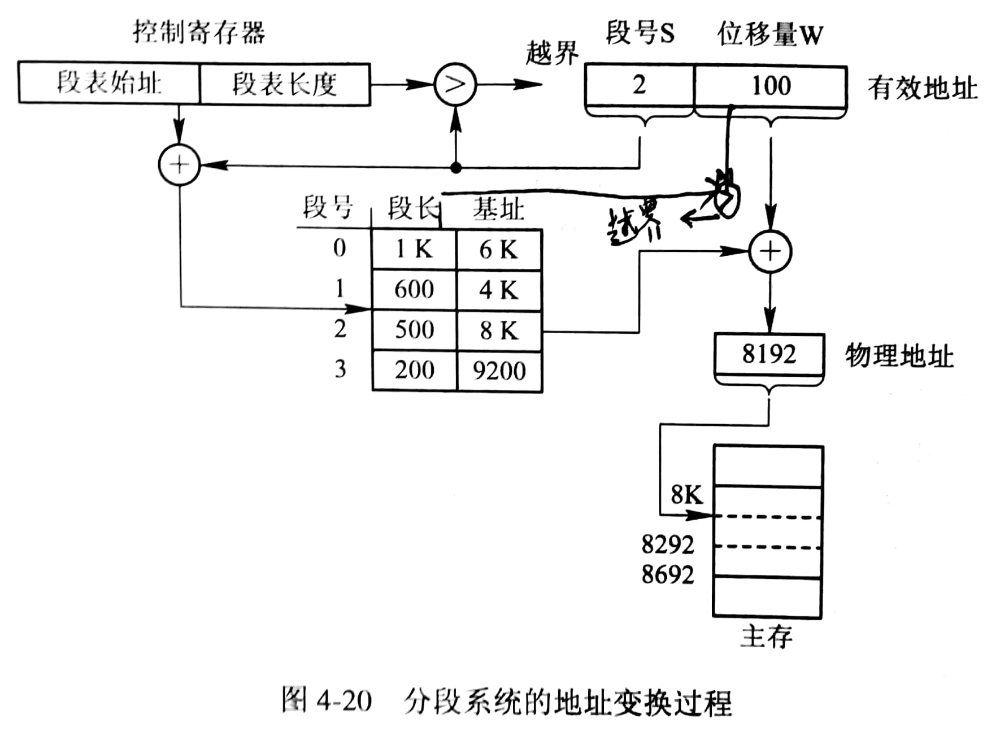
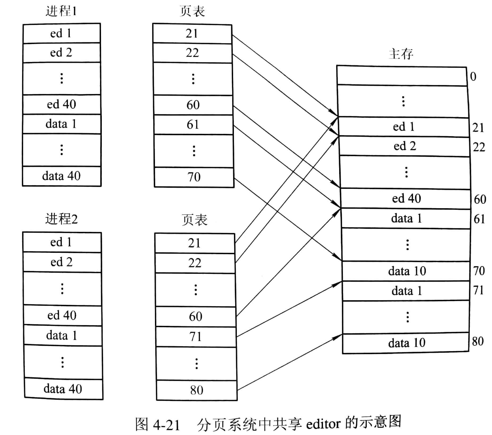
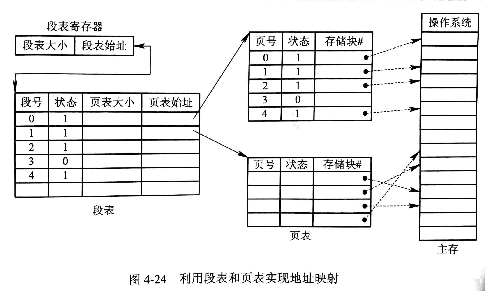
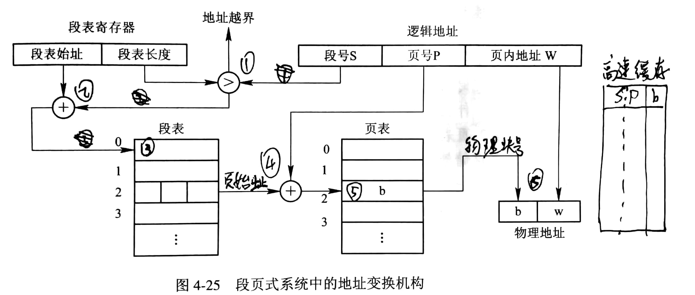

# 分段存储管理方式

## 分段存储管理方式的引入

通常程序都可分为若干个段，如主程序段、子程序 A、数据段、栈段等，每个段大多有一个相对独立的逻辑单位；而且实现和满足信息共享、信息保护、信息动态增长和动态链接也都是以段为单位。

## 分段系统基本原理

### 分段

分段地址中的逻辑地址为：`| 段号 | 段内地址 |`

每个段都是从0开始编址，并采用一段连续的地址空间，段长由相应的逻辑信息组的长度决定（各段段长不同）。每个段即包含了一部分地址空间，又标识了段与段之间的逻辑关系。

### 段表

分段存储管理系统为每个段分配一个连续的分区，进程的各个段可离散地装入内存的不同位置，用一张段映射表（段表）记录每段在内存的起始地址（基址）和段的长度。在配置了段表后，执行中的进程可通过逻辑地址中的段号来查询段表，找到段的对应内存区。

段表表项的结构为：`| 段长 | 基址 |`

### 地址变换机构

与分页存储管理类似。

## 信息共享

不同进程可共享同一段（物理内存），例如一些纯代码（程序中的指针、信号量、数组等可配以局部数据区，被进程私有），每个进程的段表中都建立该段的地址映射表项。

## 段页式存储管理方式

### 分段分页

将用户程序分为若干段，在将每段分为若干个页。

逻辑地址为：`| 段号 S | 段内页号 P | 页内地址 W | `

### 段表与页表

系统需要配置段表和页表。

### 地址变换机构

## ChangeLog

> 2018.09.12 初稿