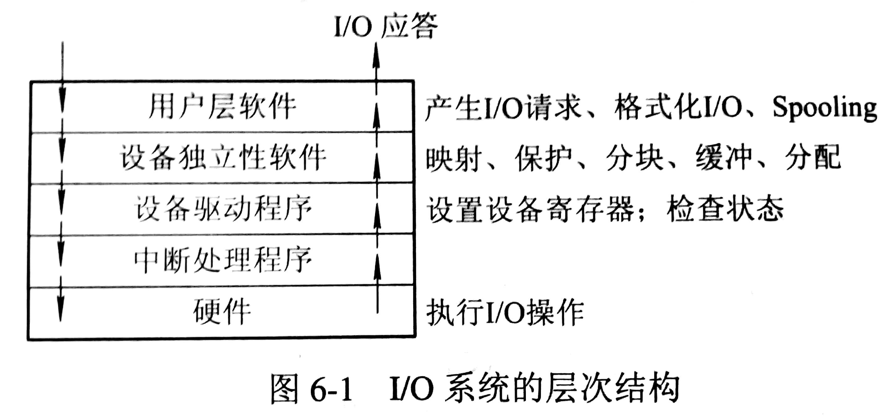
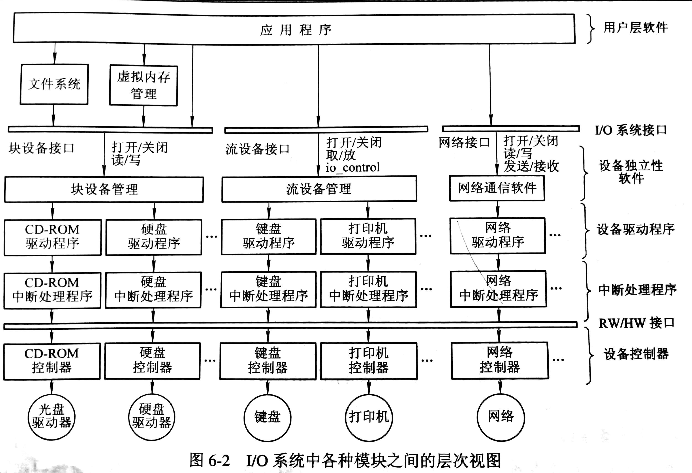

# I/O 管理

I/O 系统管理的主要对象是 I/O 设备和相应的设备控制器，其主要任务是完成用户提出的 I/O 请求，提高 I/O 速率，以及提高设备的利用率，并为更高层的进程提供方便使用设备的手段。

## I/O 系统的基本功能

### 方便用户使用 I/O 设备

- 隐藏物理设备的细节：用设备控制器实现
- 与设备无关性：在隐藏物理设备细节的基础上，增加设备驱动程序

### 提高设备利用率

- 提高处理机和 I/O 设备的利用率，尽可能的让处理机和 I/O 设备并行操作
- 对 I/O 设备进行控制：用驱动程序实现，控制方式有（轮询的可编程 I/O 方式、中断的可编程 I/O 方式、直接存储器访问方式、I/O 通道方式）

### 为用户在共享设备时提供方便

- 确保对设备的正确共享：可将设备分为独占设备和共享设备
- 错误处理：临时性错误通过重操作纠正，持久性错误向上层报告

## I/O 系统的层次结构和模型

### I/O 软件的层次结构

### I/O 系统各模块间的关系

### I/O 系统接口

I/O 系统接口是 I/O 系统与上层系统间的接口，向上层提供对设备的抽象I/O命令。可分为块设备接口、流设备接口和网络通信接口。

## ChangeLog

> 2018.09.17 初稿