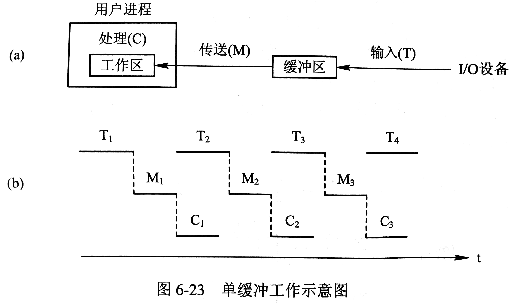
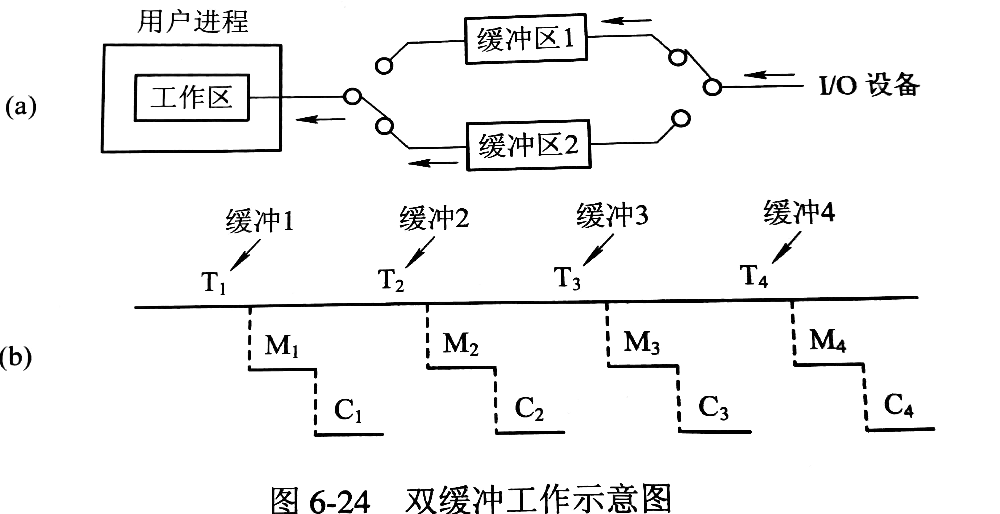
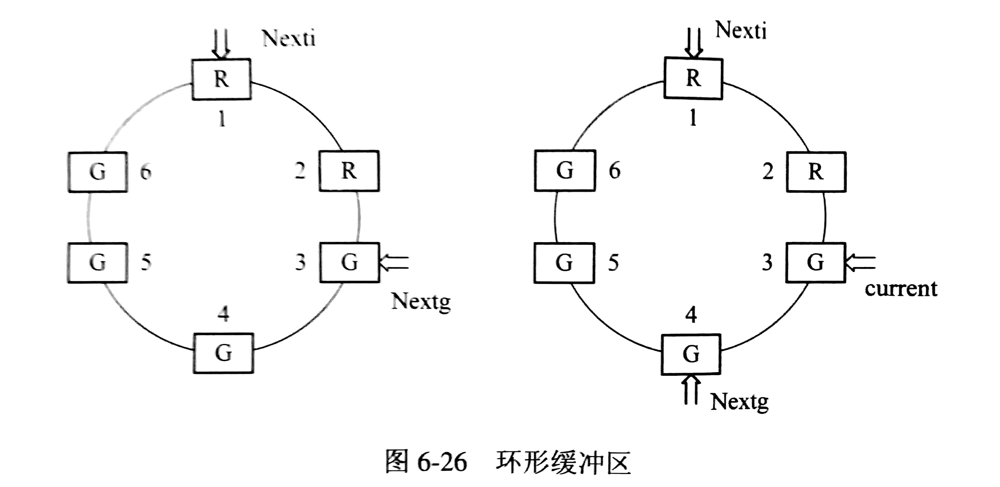
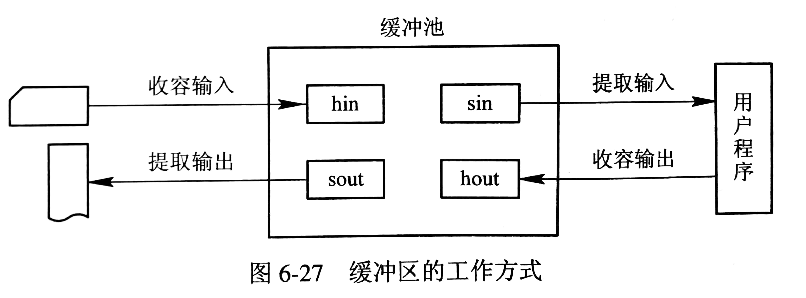

# 缓冲区管理

缓冲区引入的原因

- 缓和 CPU 与 I/O 设备间速度不匹配的矛盾
- 减少对 CPU 的中断频率，放宽对 CPU 中断响应时间的限制
- 解决数据粒度不匹配问题
- 提高 CPU 和 I/O 设备间的并行性

## 单缓冲区和双缓冲区

### 单缓冲区

单缓冲区情况下，每当用户进程发出一 I/O 请求时，OS 便在主存为之分配一缓冲区。



设从磁盘把一块数据输入到缓冲区的时间为 T，OS 将该缓冲区中的数据传送到用户区的时间为 M，CPU 对这一块数据处理的时间为 C，则 OS 处理一块数据的时间为 Max(C,T)+M

### 双缓冲区

两个缓冲区能加快输出、输入，OS 处理一块数据的时间可近似认为 Max(C,T)，即设备可连续输入或 CPU 可连续读取。



## 环形缓冲区



环形缓冲区由多个大小相同的缓冲区组成，多缓冲区可分为用于装输入数据的缓冲区 R、已装满数据的缓冲区 G 和计算进程正在使用的现行工作缓冲区C。同时设置三个指针，Nexti 指向可供下一次输入的R，Nextg 指向可供下一次输出的 G，current 指向进程正在使用的 C。

当计算进程要使用缓冲区中的数据时，可调用 Getbuf 过程，该过程将由指针 Nextg 所指示的 G 提供给进程，current 指向该缓冲区的第一个单元，同时将 Nextg 移到下一个 G。 当计算进程把 C 中数据提取完毕时，便调用 Releasebuf 过程，将缓冲区 C 改为 R。

输入进程需要使用缓冲区来装入数据时，也调用 Getbuf 过程，该过程将由指针 Nexti 所指示的 R 提供给进程，同时将 Nexti 移到下一个 R。 当输入进程把缓冲区装满时，也调用 Releasebuf 过程，将缓冲区 R 改为 G。

若 Nexti 与 Nextg 相遇，则阻塞进程，直至 Releasebuf 释放缓冲区才唤醒进程。

## 缓冲池

缓冲区仅是一组内存块的链表，属于专业缓冲；缓冲池则包含了一个管理数据结构和一组操作函数的管理机制，用于管理多个缓冲区。

### 缓冲池组成

缓冲池中的多个缓冲区，每个缓冲区由用于标识和管理的缓冲首部和用于存放数据的缓冲体两部分组成。缓冲首部一般包括缓冲区号、设备号、设备上的数据块号、同步信号量和队列链接指针等。

一般将缓冲区按类型链接成三个队列，空白缓冲队列 emq、输入队列 inq、输出队列 outq，它们的首尾指针为 F 和 L。

### Getbuf 过程和 Putbuf 过程

为使诸进程能互斥访问缓冲队列，可为每个队列设置一个互斥信号量 MS(type)；为保证诸进程同步使用缓冲区，又为每个缓冲队列设置一个资源信号量 RS(type)。

```C
void Getbuf(unsigned type){
    Wait(RS(type));
    Wait(MS(type));
    B(number)=Takebuf(type);
    Signal(MS(type));
}
void Putbuf(type, number){
    Wait(MS(type));
	Addbuf(type,number);
    Signal(MS(type));
    Signal(RS(type));
}
```

### 缓冲区工作方式

缓冲区有四种工作方式，收容输入、提取输入、收容输出、提取输出。



收容输入：输入进程调用 Getbuf(emq)过程，从 emq 的队首摘下一空缓冲区，把它作为收容输入工作缓冲区 hin。 然后把数据输入其中，装满后调用 Putbuf(inq,hin) 过程，将它挂在输入队列 inq 上。

提取输入：Getbuf(inq), Putbuf(emq,sin)

收容输出：Getbuf(emq),Putbuf(outq,hout)

提取输出：Getbuf(outq), Putbuf(emq,sout)

## ChangeLog

> 2018.09.19 初稿