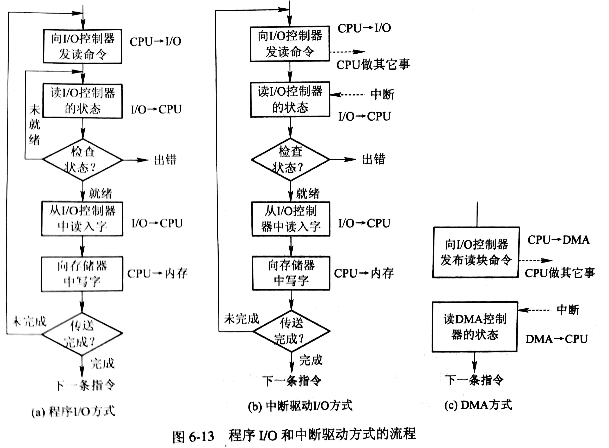
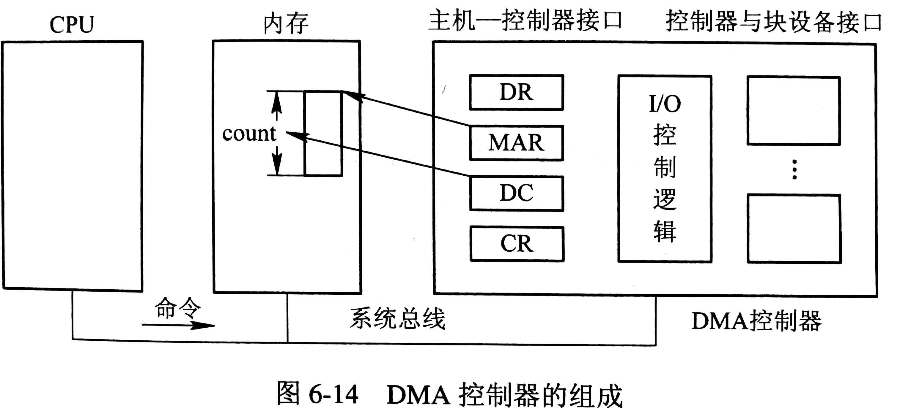
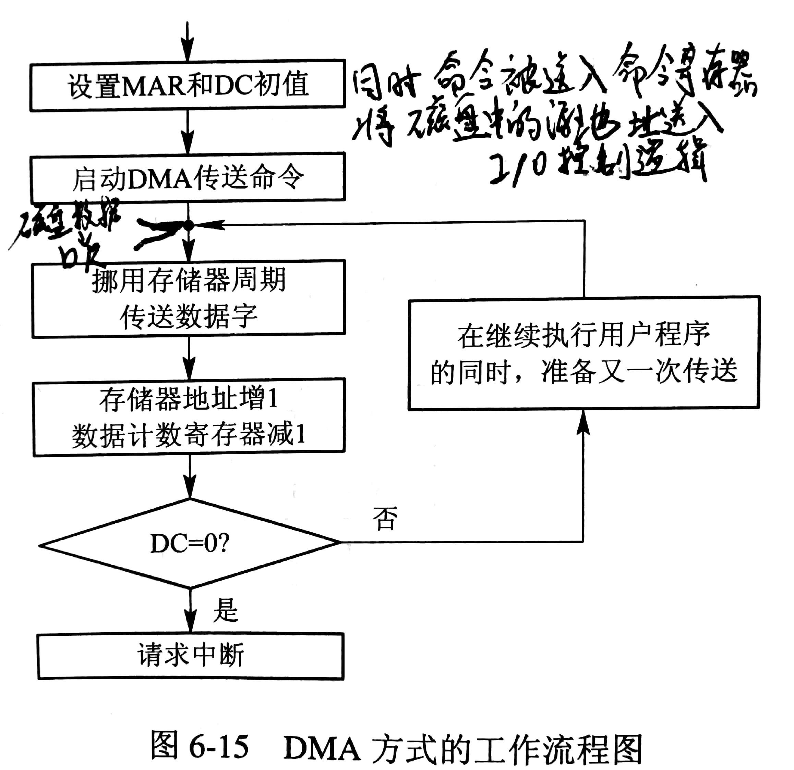

# 设备驱程序

又叫设备处理程序，主要任务是接收上层发来的抽象 I/O 要求，也将由设备控制器发来的信号传送给上层软件。

设备处理方式：

- 为每一类设备设置一个进程
- 在整个系统中设置一个 I/O 进程
- 不设置专门的设备处理进程

## 设备驱动程序的处理过程

- 将抽象要求转换为具体要求
- 对服务请求进行校验：检查该用户的 I/O 请求是不是该设备能够执行的。
- 检查设备状态：设备处于就绪状态时才能启动设备控制器。
- 传送必要参数：在确定设备处于接收（发送）就绪状态后，便可向控制器的相应寄存器传送数据及与控制本次数据传输有关的参数，例如传送数据的速度、发送的字符长度等
- 启动 I/O 设备：驱动程序向控制器中的命令寄存器传送相应的控制命令。

在多道程序系统中，驱动程序一旦发出 I/O 命令，启动一个 I/O 操作后，驱动程序便把控制返回给 I/O 系统，将自己阻塞直到中断到来，具体的 I/O 操作是在设备控制器的控制下进行。

## 对 I/O 设备的控制方式

### 使用轮询的可编程 I/O 方式

设备启动后，便将设备控制器的状态寄存器的忙/闲标志 busy 置为“1”，直至数据输入设备控制器的数据寄存器中。

### 使用中断的可编程 I/O 方式

### 直接存储器访问方式 DMA

为了传输数据块而引入， 所传送的数据直接存入内存，CPU 仅在传送一个或多个数据块的始末干预。

#### DMA 控制器

主机——控制器接口设置四类寄存器：

- 命令/状态寄存器 CR，用于接收 CPU 发来的 I/O 命令，或有关控制信息，或设备的状态
- 内存地址寄存器 MAR，在输入时存放把数据从设备传送的内存的起始目标地址，在输出时存放由内存到设备的内存源地址
- 数据寄存器 DR
- 数据计数器 DC

#### DMA 工作过程

### I/O 通道控制方式

CPU只需向 I/O 通道发送一条 I/O 指令，便可完成一组相关 I/O 操作和控制。

通道指令，包含操作码、内存首地址、计数（数据字节数）、通道程序结束位 P（1表示该指令为通道程序最后一条指令）和记录结束标志 R（1表示处理某记录的最后一条指令）。

## CHangeLog

> 2018.09.18 初稿