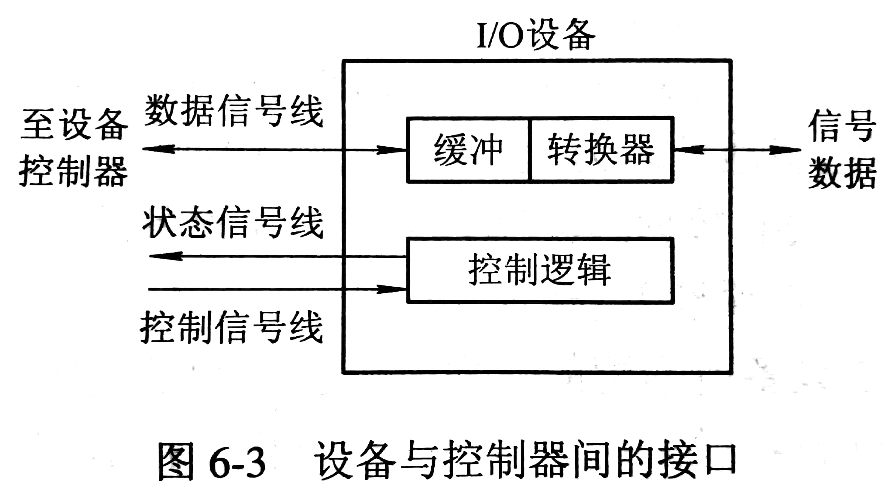
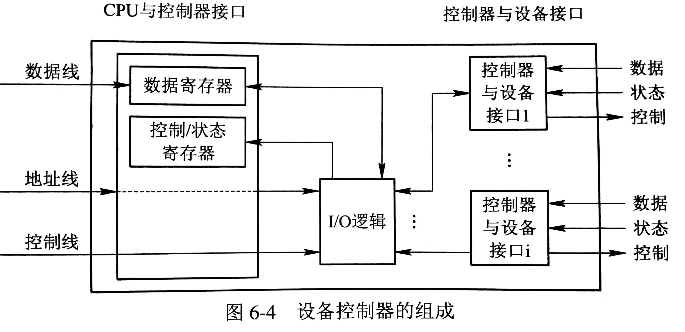
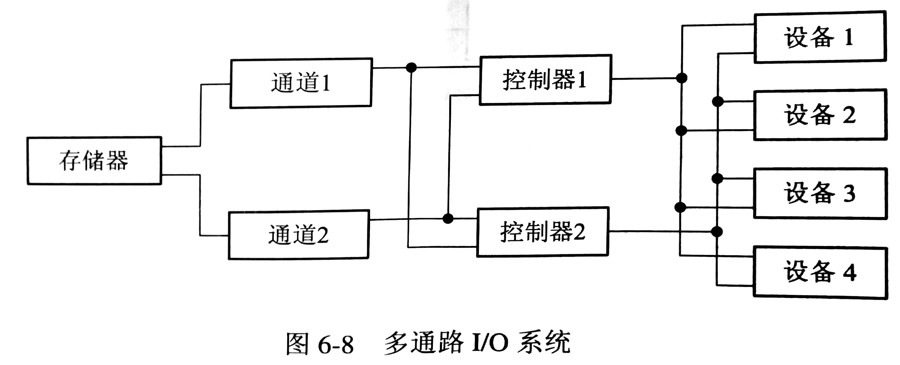

# I/O 设备和设备控制器

## I/O 设备

### 设备与控制器间的接口

I/O 设备中含有与设备控制器间的接口。

## 设备控制器

设备控制器是 CPU 与 I/O 设备间的接口。

### 设备控制器基本功能

接收和识别命令

数据交换

标识和报告设备的状态

地址识别：能够识别所控制每个设备的地址和内部寄存器地址

数据缓冲区

差错控制

### 设备控制器组成

## 内存映像 I/O

如何将数据装入设备控制器的相应寄存器呢？

### 利用特定的 I/O 指令

为每个控制寄存器分配一个 I/O 端口，设置特定的 I/O 指令。例如，`is-store cpu-reg, dev-no dev-reg` ，将 CPU 寄存器中的内容复制到控制器的寄存器中。

### 内存映像 I/O

在编制上不区分内存单元地址和设备控制器中寄存器地址，大于内存单元最大地址的地址便是设备控制器中寄存器地址。例如，`Store cpu-reg, k` ，将 CPU 寄存器中的内容复制到指定地址。

## I/O 通道

设置I/O 通道的目的是承担 CPU 处理的 I/O 任务。在设置了通道后，CPU 只需向通道发送一条 I/O 指令，通道便会从内存中取出本次要执行的通道程序，然后执行之，仅当通道完成规定的 I/O 任务后，才会向 CPU 发出中断信号。

### 通道类型

#### 字节多路通道（Byte Multiplexor Channel）

字节多路通道含有多个非分配型子通道，它们按时间片轮转方式共享主通道。

#### 数组选择通道（Block Selector Channel）

数组选择通道只含有一个分配型子通道，只允许一个设备占用主通道，直至设备释放主通道。

#### 数组多路通道（Block Multiplexor Channel）

数组多路通道含有多个非分配型子通道，数据传送按数组方式进行。

### 多通路

把一个设备连接到多个控制器上，一个控制器又连接到多个通道上，能增加系统吞吐量，并有一定的抗故障能力。

## ChangeLog

> 2018.09.17 初稿