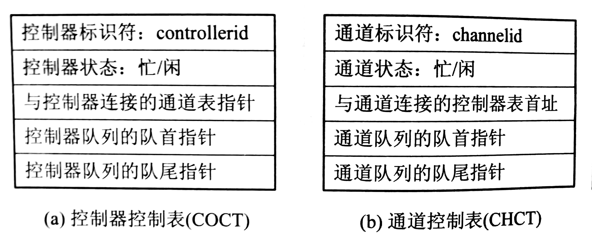

# 设备独立性 I/O 软件

为了实现设备独立性，必须在设备驱动程序之上设置一层与设备无关的 I/O 软件，以实现逻辑设备名到物理设备名的转换。

## 与设备无关的软件功能

- 设备驱动程序的统一接口
- 缓冲管理
- 差错控制：暂时性错误和持久性错误的处理
- 对独立设备的分配与回收：独占设备和共享设备的分配和回收
- 独立于设备的逻辑数据块：整合不同大小数据块，并向高层软件提供统一大小的逻辑数据块

## 设备分配

### 数据结构

#### 设备控制表 DTC

设备控制表 DCT，每个表项记录设备类型（type）、设备标识符（deviceid）、设备状态（忙/闲）、指向控制器表的指针、重复执行次数或时间，设备队列的队首指针（指向请求本设备但未得到满足的进程 PCB 队列）。

#### 控制器控制表（COCT）和通道控制表（CHCT）

系统为每个控制器都设置了用于记录控制器情况的控制器控制表，每个通道都有一张通道控制表。

#### 系统设备表（SDT）

系统设备表是系统范围的数据结构，记录了系统中全部设备的情况，每个设备占一个表目，其中包括设备类型、设备标识符、设备控制表及设备驱动程序入口。

### 独占设备的分配程序

#### 分配设备

根据 I/O 请求中的物理设备名查找SDT，从中找到该设备的 DCT，可知设备状态。若忙，则将进程的 PCB挂到设备队列上；否则计算此次设备分配的安全性，若不会导致系统进入不安全状态则将设备分配给请求进程，否则将进程的 PCB 挂到设备队列。

#### 分配控制器

在系统把设备分配给请求 I/O 的进程后，再将其 DCT 中找出与该设备连接的控制器的 COCT，可知控制器的状态。若忙，则将进程的 PCB 挂到控制器的等待队列上；否则便将控制器分配给进程。

#### 分配通道

在该 COCT 中也可找到与该控制器连接的通道的 CHCT，则可知通道状态。若忙，则将进程的 PCB 挂到通道的等待队列上；否则便将通道分配给进程。然后启动 I/O 设备进行数据传送。

## 逻辑设备名到物理设备名的映射

### 逻辑设备表 LUT（Logical Unit Table）

表项结构为：`| 逻辑设备名 | 物理设备名 | 设备驱动程序 |`

单用户系统，整个系统可设置一张 LUT；多用户系统可为每个用户设置一张 LUT，并将逻辑设备名映射到 SDT。

## ChangeLog

> 2018.09.18 初稿