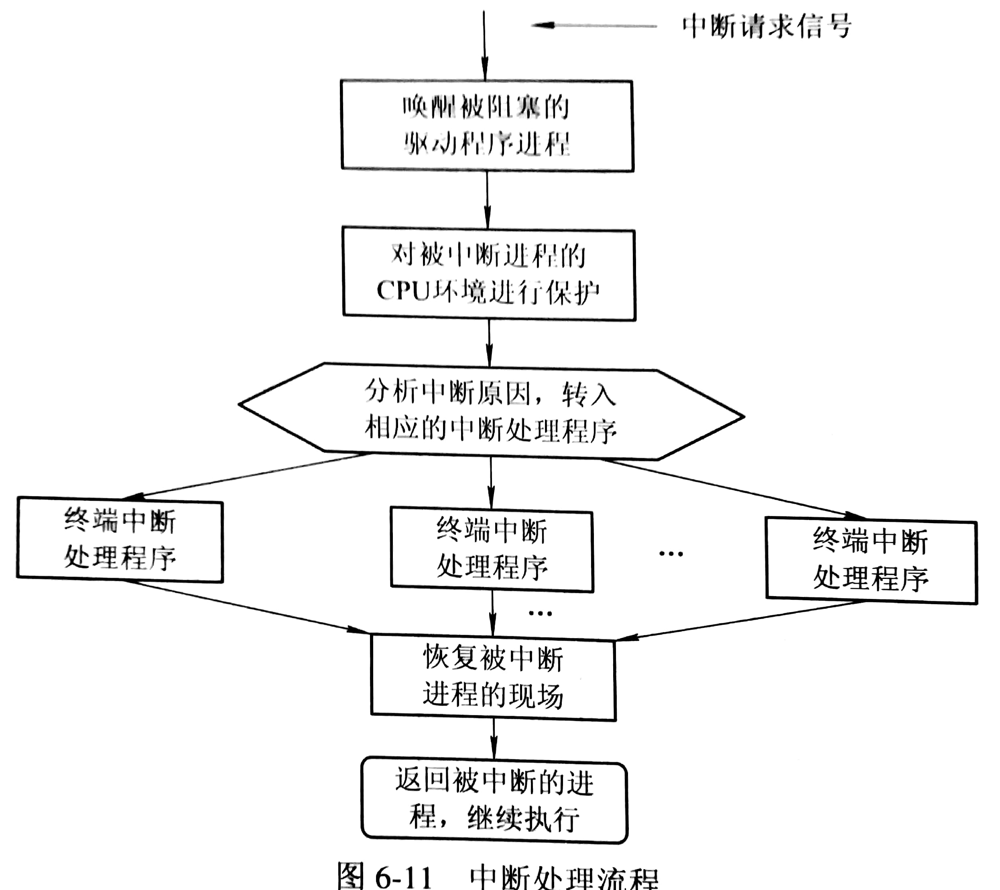
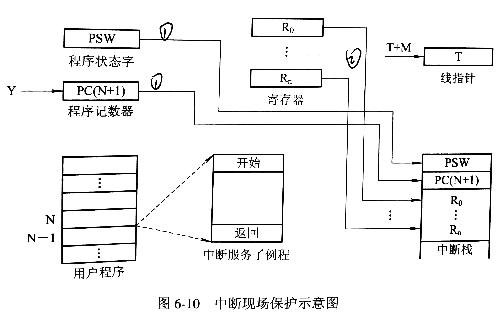

# 中断机构和中断处理程序

## 中断机构

### 中断和陷入

#### 中断

中断指 CPU 对 I/O 设备发来的中断信号的一种相应，由于中断是外部设备引起的，中断又称外中断。

#### 陷入

陷入（trap）指由 CPU 内部事件引起的中断，例如运算的溢出。

### 中断向量表和中断优先

为处理方便，通常为每种设备配以相应的中断处理程序，并把该程序的入口地址放在中断向量表的一个表项中，并为每个设备的中断请求规定一个直接对应到表项的中断信号。

系统也为中断信号源规定优先级。

### 对多中断源的处理方式

当系统正在处理一个中断时，又来了一个优先级更高的中断请求，如何处理？

#### 屏蔽（禁止）中断

当一个处理机正在处理一个中断时，屏蔽所有中断。

#### 嵌套中断

高优先级的中断请求可抢占低优先级的中断。

## 中断处理程序

当一个进程请求 I/O 操作时，该进程将被挂起，直到 I/O 设备完成 I/O 操作后，设备控制器便向 CPU 发送一个中断请求，CPU 响应后便转向中断处理程序，中断处理完成后便接触相应进程的阻塞状态。

I/O操作完成后，驱动程序必须检查本次 I/O 操作是否发生错误，并向上层软件报告，最终向调用者报告本次 I/O 的执行情况。

### 中断处理程序的处理过程

1. 测定是否有未响应的中断信号：处理在每执行完一个指令后都会测试有无未响应中断信号。

2. 保护被中断进程的 CPU 环境

   

3. 转入相应的设备处理程序：由处理机对各个中断源进行测试，以确定本次中断的 I/O 设备，并向中断源发送确认信号。在该设备收到信号后立即取消中断请求信号，处理机将相应的设备中断处理程序的入口地址装入程序的计数器中。

4. 中断处理：中断程序先从设备控制器中读出设备状态，若是正常完成中断，则做结束处理；若是异常结束，则根据异常原因做相应处理。

5. 恢复 CPU 的现场并退出中断

## ChangeLog

> 2018.09.17 初稿