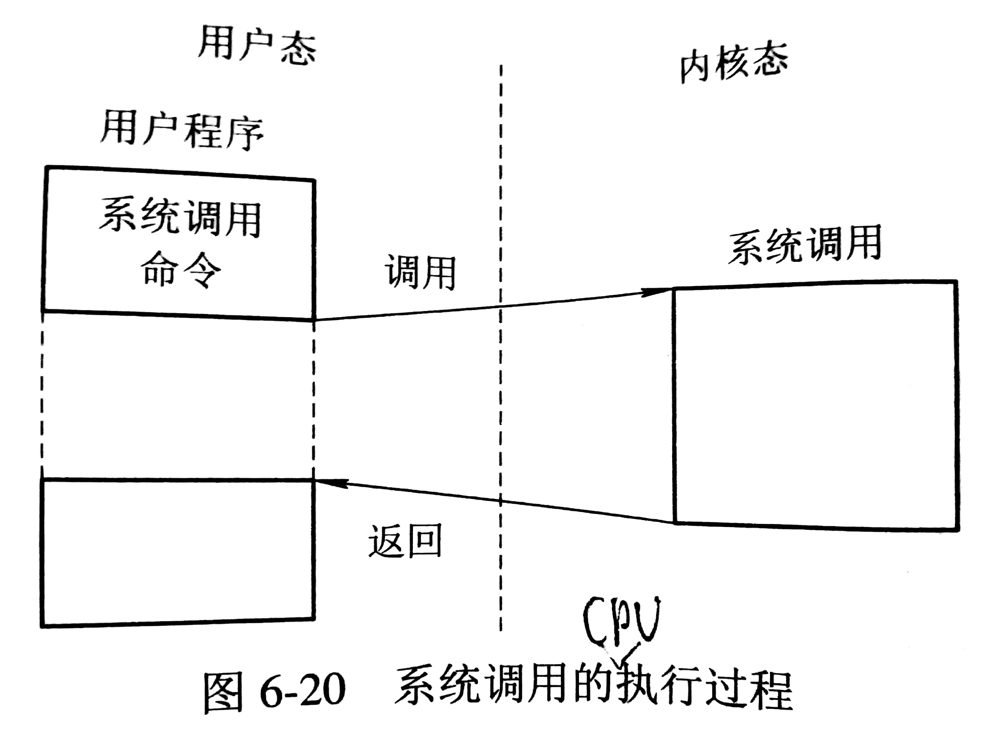
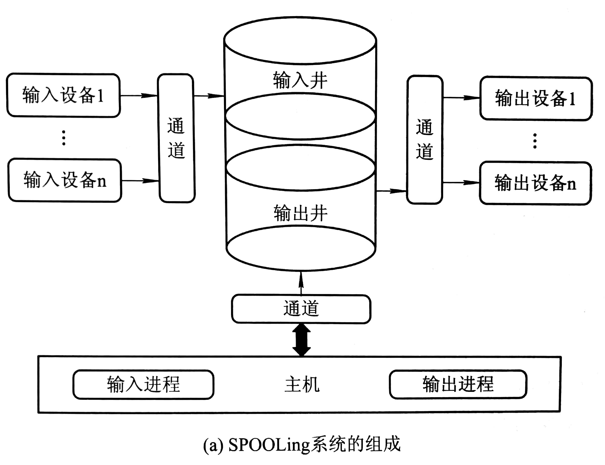
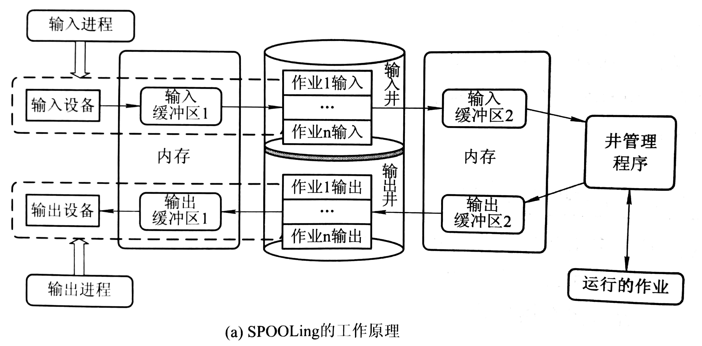
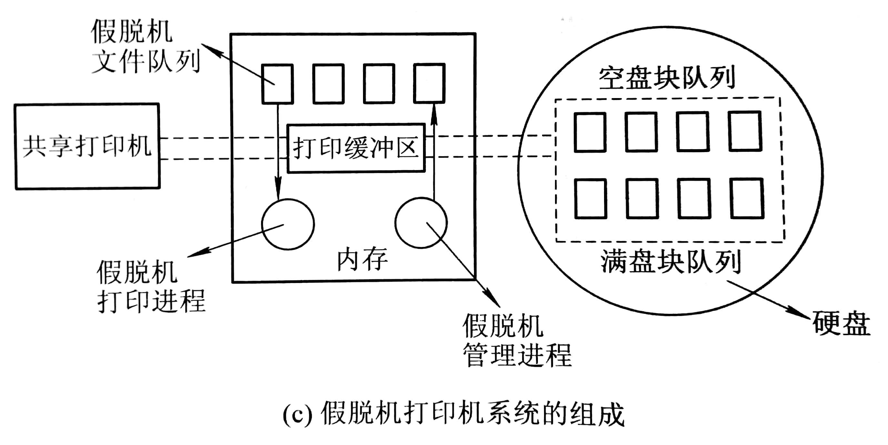

# 用户层的 I/O 软件

大部分的 I/O 软件都放在 OS 内部，但仍有少部分在用户层。

## 系统调用与库函数

### 系统调用

为使进程能有条不紊使用 I/O 设备，且保护设备的安全性，不允许运行在用户态的应用程序直接调用运行在内核态的 OS 过程，但有用户态的应用程序必须取得 OS 提供的服务，由此引入系统调用。应用程序可通过系统调用间接调用 OS 中的 I/O 过程，对设备进行操作。

### 库函数

内核提供了 OS 的基本功能，而库函数拓展了 OS 内核，使用户方便取得操作系统的服务。

## 假脱机（Spooling）系统

### 假脱机技术

假脱机技术可将一台物理I/O 设备虚拟为多台逻辑 I/O 设备，从而允许多个用户共享一台物理 I/O 设备。

利用多道程序中的两道模拟分别模拟输入和输出时的外围控制机，外围操作与 CPU 对数据的处理同时进行，此联机情况称为假脱机技术（Simultaneous Peripheral Operation On-Line）。

### SPOOLing 组成

SPOOLing 系统建立在通道技术和多道程序技术的基础上，以高速随机外存（通常是磁盘）为后援存储器。

- 输入井和输出井，是在磁盘开辟出来的两个存储区域，分别用于收容 I/O 设备输入数据和用户程序输出数据，输入/输出井的数据一般以文件（井文件）的形式组织管理，一个井文件仅存放某一个进程的输入（输出）数据，所有井文件链接成一个输入（输出）队列。
- 输入/输出缓冲区，是在内存中开辟的两个缓冲区，用于暂存传送数据。
- 输入/输出进程，用于模拟外围控制机。
- 井管理程序，用于控制作业与磁盘井之间信息的交换。

### 假脱机打印机系统

假脱机管理进程为每个要求打印的用户数据建立一个假脱机文件，并把它放入假脱机文件队列中，由假脱机打印进程依次对队列中的文件进行打印。

### 守护进程（daemon）

守护进程是实现设备共享的另一种方案。守护进程是允许使用对应设备的唯一进程，所有需要使用特定 I/O 设备的进程都需要将一份要求输出的文件放在假脱机文件队列中，由守护进程在 I/O 设备空闲时逐份输出。

## ChangeLog

> 2018.09.18 初稿

