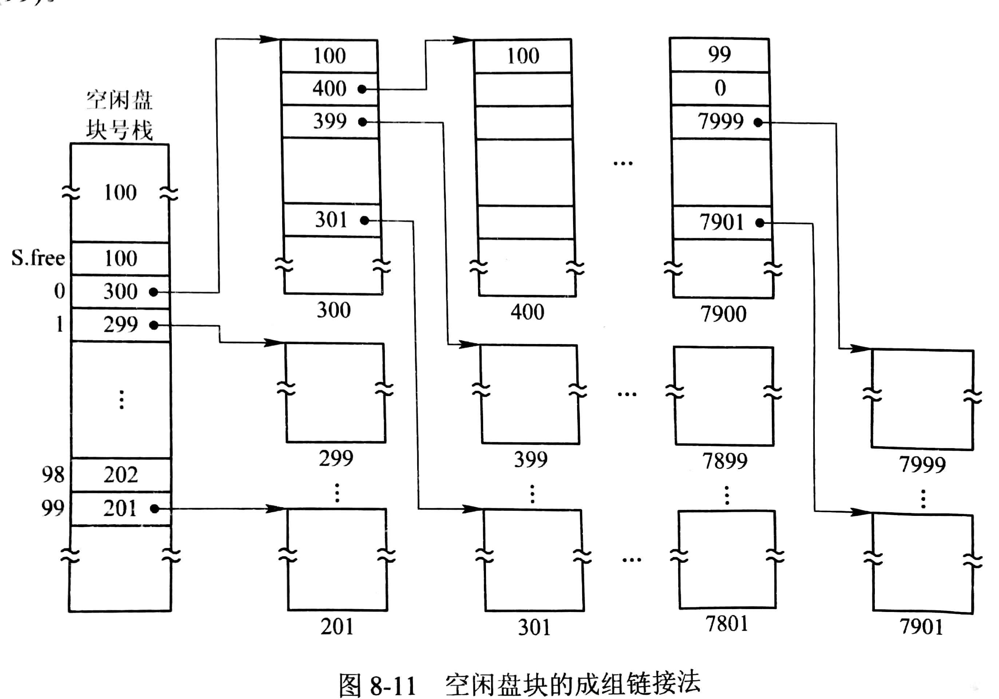

# 文件存储空间管理

## 空闲表法和空闲链表法

### 空闲表法

与动态内存分配类似，系统为外存上的所有空闲区建立一张空闲表，每个空闲区对应一个空闲表项，包括表项序号、该空闲区的第一个盘块号、该区的空闲盘块数等信息。

### 空闲链表法

空闲盘块链法是将所有空闲盘区拉成一条空闲链，可根据构成链所用基本元素的不同，分为空闲盘块链和空闲盘区链。

- 空闲盘块链：将所有空闲空间以盘块为单位拉成一条链，每个盘块都有指向后继盘块的指针。
- 空闲盘块区链：将所有空闲空间以盘块区为单位拉成一条链，每个盘块区都有指向后继盘块的指针和指明盘区大小（盘块数）的信息，采用首次适应法分配内存。

## 位示图法

位示图是 m*n 的矩阵，总数等于磁盘的总块数，第 i 行第 j 列表示第 n(i-1)+j 个盘块，把 “0” 作为空闲标志。分配时，顺序扫描位示图，从中找到一个或一组值为“0”的位置，计算对应的盘块号，并分配空间和修改位示图。

## 成组链接法

### 空闲盘块的组织

- 空闲盘块号栈，用来存放当前可用的一组空闲盘块号（最多100个号），以及栈中尚有的空闲盘块数 N（兼做栈顶指针），为使每次仅有一个进程访问，OS 为栈设置了一把锁。
- 文件区中的所有空闲盘块被分成若干个组（例如100个盘块一组），将每一组含有的盘块总数 N 和该组所有的盘块号记入其前一组的第一个盘块的 S.free(0)~S.free(99)中，由此各组的第一个盘块可链成一条链。
- 将第一组的盘块总数和所有盘块号记入空闲盘块号栈中，作为当前可供分配的空闲盘块号。
- 最末组只有99个盘块，其盘块号分别记入前一组的S.free(1)~S.free(99)中，而 S.free(0)则存放“0”，作为空闲盘块的结束标志。

### 空闲盘块的分配与回收

当系统要为用户分配文件所需的盘块时，须调用盘块分配过程来完成。

- 检查空闲盘块号栈是否上锁，若未上锁，则从栈顶取出一空闲盘块号，将与之对应的盘块分配给用户，然后栈顶指针下移一格
- 若盘块指针已是栈底（即 S.free(0)），该盘块中记有下一组可用的盘块号，因此须要调用磁盘读过程将栈底盘块号所对应盘块的内容读入栈中，作为新的盘块号栈的内容，并把原栈底对应的盘块分配出去。
- 再分配一相应的缓冲区，作为该盘块的缓冲区
- 把栈中的空闲盘块数减“1”，并返回

在系统回收空闲盘块时，须调用盘块回收过程来完成。

- 将回收盘块的盘块号记入空闲盘块号栈的顶部，并将空闲盘块数加“1”
- 当空闲盘块数目已达100时，便将现有栈中的100个盘块号记入新回收的盘块中，再将其盘块号作为新栈底

## ChangeLog

> 2018.09.24 初稿