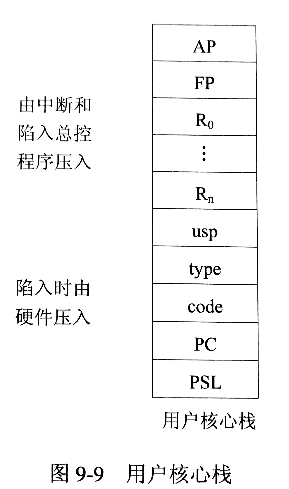

# 系统调用的实现

当应用程序使用 OS 的系统调用时，产生一条相应的指令，CPU 在执行这条指令时发生中断，并将有关信号送给中断和陷入硬件机构，该机构收到信号后，启动相关的陷入处理程序进行处理，实现该系统调用所需的功能。

## 系统调用的实现方法

### 系统调用号和参数的设置

系统中每条系统调用都对应唯一一个系统调用号，在系统调用命令（陷入命令）中把相应的系统调用号传递给中断和陷入机制。

每条系统调用都含有若干个参数，将参数传递给陷入处理机构和系统内部的子程序的实现方法有

- 陷入指令自带方式
- 直接将参数送入相应的寄存器中
- 参数表方式（主流方法）：将系统调用所需的参数放入一张参数表中，并将指向该参数表的指针放在某个指定的寄存器中

### 系统调用的处理步骤

1. 将处理机状态由用户态转为内核态，之后保护现场（将处理机状态字 PSW 、程序计数器 PC、系统调用号和用户指针栈等压入堆栈），并将用户定义的参数传送到指定的地址保存起来
2. 分析系统调用类型，通过系统调用入口表转入相应的系统调用处理子程序
3. 在系统调用处理子程序执行完后，恢复中断或设置新进程的 CPU 现场，返回被中断进程或新进程继续执行

## UNIX 系统调用的实现

在 UNIX 系统 V 的内核程序中，有个 trap.S 文件（中断和陷入总控程序）和一个 trap.C 文件（用于处理各种陷入情况）。



### CPU 环境保护

- 当用户程序处在用户态，且在执行系统调用命令（即 CHMK 命令）之前，应在用户空间提供系统调用所需的参数表，并将该参数表的地址送入R0寄存器。
- 在执行 CHMK 命令后，处理机将由用户态转为核心态，并由硬件自动地将处理机状态长字（PSL），程序计数器（PC）和代码操作数（code）压入用**户核心栈**，继而从中断和陷入向量表中取出 trap.S 的入口地址，然后便转入中断和陷入总控程序 trap.S 中执行。
- trap.S 程序执行后，继续将陷入类型 type 和用户栈指针 usp 压入用户核心栈，接着还要将被中断进程的 CPU 环境中的一系列寄存器如 R0~R11的部分或全部内容压入栈中（至于哪些寄存器的内容要压入栈中，这取决于特定寄存器中的屏蔽码，该屏蔽码的每一位都与R0~R11中的一个寄存器相对应，当某一位置成1时，表示对应寄存器的内容应压入栈中）。

### AP 和 FP 指针

- 为了实现系统调用的嵌套使用，在系统中还设置了两个指针，其一是系统调用参数表指针 AP，用于指示正在执行的系统调用所需参数表的地址，通常是把该地址放在某个寄存器中，例如放在R12中。
- 还须设置一个调用栈帧指针（简称栈帧 ）FP，指示本次系统调用需要保存而被压入用户核心栈的所有数据项。
- 当 trap.S 完成被中断进程的 CPU 环境和 AP 及 FP 指针的保存后，将会调用由 C 语言书写的公共处理程序 trap.C，以继续处理本次的系统调用所要完成的公共处理部分。

### 确定系统调用号

在中断和陷入发生后，应先经硬件陷入机构予以处理，再进入中断和陷入总控程序 trap.S，在保护好 CPU现场后再调用 trap.C 继续处理。其调用形式为：

`trap（usp，type，code，PC，PSL）`

其中，参数 PSL 为陷入时处理机状态字长，PC 为程序计数器，code 为代码操作数，type为陷入类型号，usp为用户栈指针。

对陷入的处理可分为多种情况，如果陷入是由于系统调用所引起的，则对此陷入的第一步处理便是确定系统调用号。通常，系统调用号包含在代码操作数中，故可利用 code 来确定系统调用号 i。其方法是：令

`i=code&0377`

若 0<i<64 ，此便是系统调用号，可根据系统调用号i和系统调用定义表，转向相应的处理子程序。若i=0，则表示系统调用号并未包含在代码操作数中，此时应采用间接参数方式，利用间接参数指针来找到系统调用号。

### 参数传送

参数传送是指由 trap.C 程序将系统调用参数表中的内容从用户区传送到 User 结构的 U.U-arg 中，供系统调用处理程序使用。由于用户程序在执行系统调用命令之前已将参数表的首址放入R0 寄存器中，在进入 trap.C 程序后，该程序便将该首址赋予 U.U-arg 指针，并读取该指针的内容，将参数表送至 U.U-arg 中。

 应当注意，对不同的系统调用所需传送参数的个数并不相同，trap.C 程序应根据在系统调用定义表中所规定的参数个数来进行传送，最多允许10个参数。

### 利用系统调用定义表转入相应的处理程序

在 UNIX 系统中，对于不同（编号）的系统调用，都设置了与之相应的处理子程序。为使不同的系统调用能方便地转人其相应的处理子程序，也将各处理子程序的入口地址放入了系统调用定义表即 Sysent[]中（该表是一个结构数组，在每个结构中包含三个元素，即相应系统调用所需参数的个数、经寄存器传送的参数个数、处理子程序的入口地址）。

- 在系统中设置了该表之后，便可根据系统调用号 i 从系统调用定义表中找出相应的表目，再按照表目中的入口地址转入相应的处理子程序，由该程序去完成相应系统调用的特定功能。
- 在该子程序执行完后，仍返回到中断和陷入总控程序中的 trap.C 程序中，去完成返回到断点前的公共处理部分。

### 系统调用返回前的公共处理

在 UNIX 系统中，进程调度的主要依据是进程的动态优先级。随看进程执行时间的加长，其优先级将逐步降低。UNIX 系统规定，当进程的运行是处于系统态时，即使再有其它进程又发来了信号，也不予理睬。仅当进程已从系统态返回到用户态时，内核才检查该进程是否已收到了由其它进程发来的信号。

- 每当执行了系统调用命令并由系统调用处理子程序返回到 trap.C 后，都将重新计算该进程的优先级（若在系统调用执行过程中，若发生了错误使进程无法继续运行时，系统会设置再调度标志）。
- 处理子程序在计算了进程的优先级后，又去检查该再调度标志是否已又被设置。若已设置，便调用 switch 调度程序，再去从所有的就绪进程中选择优先级最高的进程，把处理机让给该进程去运行。
- 若有由其它进程发来的信号，便立即按该信号的规定执行相应的动作。
- 在从信号处理程序返回后，还将执行一条返回指令RET，该指令将把已被压入用户核心栈中的所有数据（如PSL、PC、FP及AP 等）都退还到相应的寄存器中，这样，即可将CPU控制权从系统调用返回到被中断进程，后者继续执行下去。

## Linux 系统调用

### 系统调用组成

#### 内核函数与接口函数

与 UNIX 相似，Linux 采用类似技术实现系统调用。Linux 最多可以有190个系统调用，应用程序和 Shell 需要通过系统调用机制访问 Linux 内核（功能）。每个系统调用由两部分组成：

- 内核函数：是实现系统调用功能的（内核）代码，作为操作系统的核心驻留在内存中，是一种共享代码，用 C 语言书写。它运行在内核态，数据也存放在内核空间，通常不能再使用系统调用，也不能使用应用程序可用的库函数。
- 接口函数：是提供给应用程序的 API，以库函数形式存在 Linux 的 lib.a 中，该库中存放了所有系统调用的接口函数的目标代码，用汇编语言书写。其主要功能是，把系统调用号、入口参数地址传送给相应的核心函数，并使用户态下运行的应用程序陷入核心态。

#### 系统调用入口程序

Linux 中有一个用汇编写的系统调用入口程序 `entry(sys_call_table)`，它包含了系统调用入口地址表，给出了所有系统调用核心函数的名字，而每个系统调用核心函数的编号由 `include/asm/unistd.h` 定义：

```C
ENTRY（sys-call-table）
	long SYMBOL_NAME（sys_xxx）i
```

#### 系统调用号

Linux 的系统调用号就是系统调用入口表中位置的序号。所有系统调用通过接口函数将系统调用号传给内核，内核转入系统调用控制程序，再通过调用号位置来定位核心函数。Linux 内核的陷入由 0x80(int80h) 中断实现。

### 系统调用控制程序的工作流程为

1. 取系统调用号，检验合法性
2. 执行 int 80h 产生中断
3. 进行地址空间的转换，以及堆栈的切换，进入内核态
4. 进行中断处理，根据系统调用号定位内核函数地址
5. 根据通用寄存器内容，从用户栈取入口参数
6. 核心函数执行，把结果返回应用程序

## Win32 的应用程序接口（API）

系统调用是通过中断向内核发出一个请求，而 API 是一个函数的定义，说明如何获得一个给定的服务。Windows OS 在程序设计模式上与 UNIX 有根本上的差异，Windows 采用事件驱动方式，即主程序等待事件发生（例如鼠标点击），根据事件内容调用相应的程序进行处理。

每次 API 调用会创建一个对象（例如文件、进程），并将对象句柄（指向对象的索引）返回给调用者。

## ChangeLog

> 2018.09.27 初稿