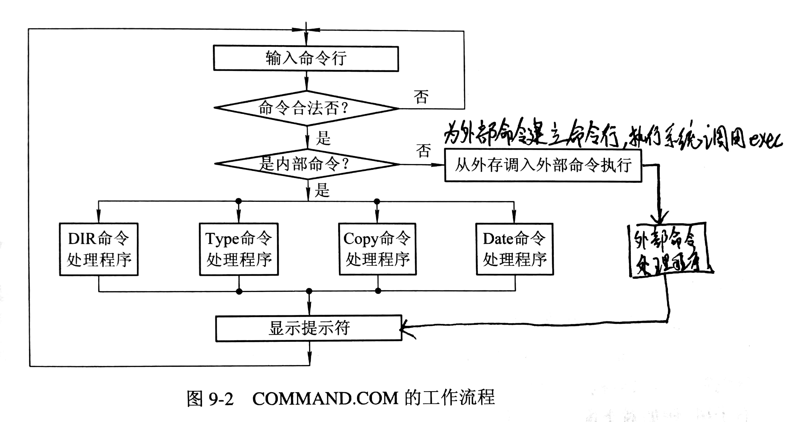
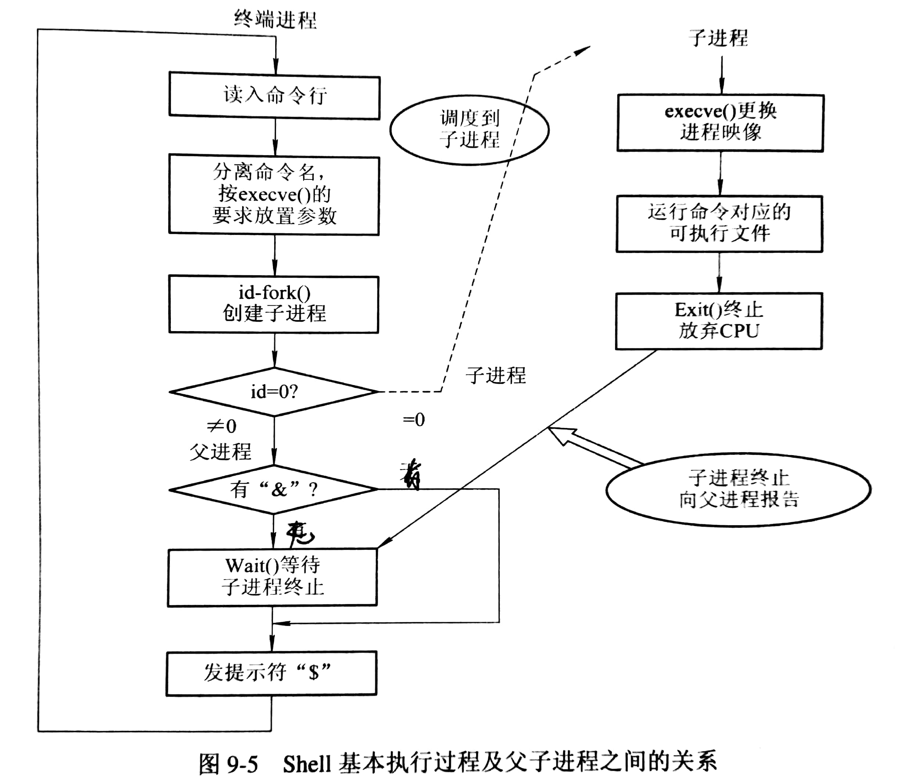

# 用户接口

用户接口一般可分为字符显示式联机用户接口、图形化联机用户接口和脱机用户接口。

## 字符显示式联机用户接口（联机命令接口）

联机命令接口指用户通过命令语言实现对作业的控制，以及取得操作系统的服务。

### 命令行方式

以行为单位，输入和显示不同命令，回车符作为一个命令的结束标记。通常，命令的执行采用间断式的串行执行方式，即后一个命令的输入需要等前一个命令执行结束（也可在命令结尾输入特定标记使之与后台执行）。

简单命令的一般形式：`Command arg1 arg2 ...`

Shell 格式为：`Command -option argument list`

### 批命令方式

批命令方式允许用户预先把一系列命令组织在一种称为批命令文件的文件中，一次建立，多次执行。

## 图形化联机用户接口

图形化用户接口（Graphics User Interface）采用图形化的操作界面，使用 WIMP 技术（将 Windows、图标 Icon、Menu 和鼠标 Pointing device和面向对象技术集成在一起）。

## 联机命令的类型

### 简单命令类型

- 进入和退出系统：login 和 logout
- 文件操作命令：cat、cp、mv、rm、file(显示文件类型)
- 目录操作命令：mkdir、rmdir、cd
- 系统询问命令：date、who、pwd

### 输入输出重定向命令

命令的输入取自标准输入设备（键盘），命令的输出送往标准输出设备（显示器），可用 `>` 重定向输出设备，可用 `<` 重定向输入设备，后接文件名或设备名。

以 Shell 为例：

`cat file1>file2` ：将文件1的输出输入到文件2中

`wc<file3` ：把从文件3中读出的行中的字和字符串进行计数

`cat file1>>file2` ：将文件1的输出输入到文件2的末尾

`a.out<file3>file4` ：在可执行文件 a.out 执行时，将从文件3中提取数据，而把 a.out 的执行结果数据输出到文件4

### 管道连接命令

把第一条命令的输出信息作为第二条命令的输入信息，一般格式为 `Command1 |Command2 |...|Commandn`

以 Shell 为例：

`cat file | wc` ：将使命令 cat 把文件 file 中的数据作为 wc 的命令计数输入

### 其他命令

- 过滤命令：用于读取指定文件或标准输入，从中找出由参数指定的模式，然后把所有包含该模式的行都打印出来。`find "字符串" (路径名)`
- 批命令

## Shell 的通信命令和后台命令

### 通信命令

- 信箱通信：信箱通信是作为在 Unix 的各个用户之间进行的非交互式通信工具，通常各用户的私有信箱采用各自的注册名命名，即它是目录 `/usr/spool/mail` 中的一个文件，而文件名又用接受者的注册名命名。读取信件命令为： `mail` ；发送信件时，``mail` 命令须后接接受者的注册名作参数
- 对话通信命令：对话通信命令可使用户与当前在系统的其他用户直接进行联机通信。命令格式为：`write user[ttyname]`
- 允许和拒绝接收消息的 mesg 命令：用命令 `mesg[-n][-y]`  来拒绝和允许对方的写许可

### 后台命令

用户可在命令后面加上 `&` 来告诉 Shell 将命令放在后台执行。

在后台运行的程序仍然把终端作为它的标准输出和标准输入文件，重定向后标准输入文件会自动定向到 `/dev/null` 。

用户可使用 ps、wait、kill 命令去了解和控制后台进程的运行。

## 联机命令的接口的实现

### 键盘终端处理程序

基本功能是接收用户从终端键入的命令和数据，并将它们暂存在字符缓冲区中，具体功能有

- 接收字符，有按字符和按行两种接收方式
- 字符缓冲，有为每个终端分配一个专用缓冲区和系统只设置一个公共缓冲区（并将空缓冲区和每个终端输入分别链接成链）
- 回送显示，将输入的字符回送到屏幕上
- 屏幕编辑
- 特殊字符处理，例如终端字符 Ctrl+C，停止上卷字符 Ctrl+S，恢复上卷字符 Ctrl+Q

### MS-DOS 解释程序

命令解释程序的主要作用是在屏幕上给出提示符，请用户键入命令；然后读入命令，识别命令；转到相应命令处理程序入口地址，把控制权交给该处理程序，并将结果显示在屏幕上。若用户键入的命令有错，则应显示出某一出错信息。

#### MS-DOS 解释程序由三部分组成

- 常驻部分，包括一些中断服务子程序
- 初始化部分，跟随在常驻内存部分之后，在启动时获得控制权
- 暂存部分，主要是命令解释程序，它们驻留在内存中，但用户程序可覆盖它，在用户程序结束时，常驻程序会将它们重新从磁盘调入内存。

#### MS-DOS 解释程序工作流程为

### Shell 解释程序

#### Shell 命令特点

- 一条命令中含有多条命令
- 具有不同的分隔符，例如 `;` 表示命令顺序执行，`&` 表示命令后台执行，`|` 管道

#### 二叉树结构的命令行树

每当遇见 `;` 和 `&` 分隔符，为之建立一个命令表型节点；遇见 `|` 分隔符，为之建立一个管道文件型节点。

#### Linux 命令解释程序的工作流程

## ChangeLog

> 2018.09.25 初稿