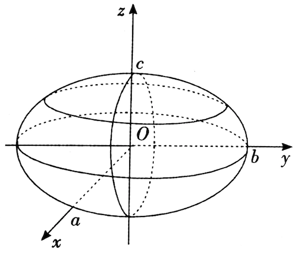
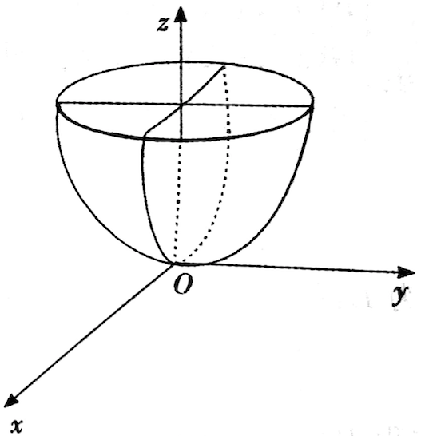
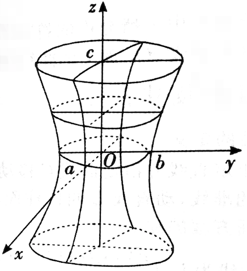
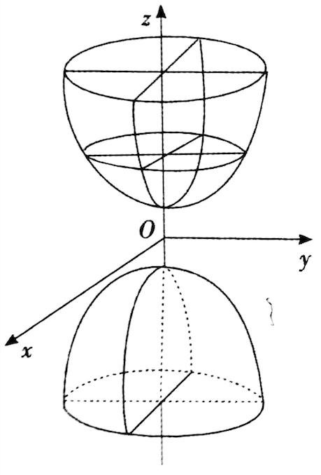
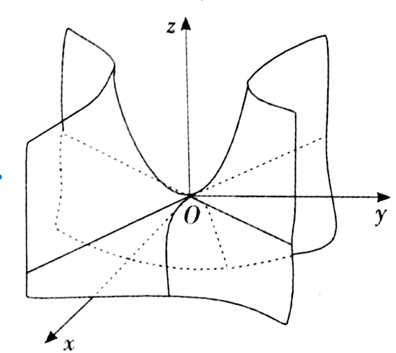
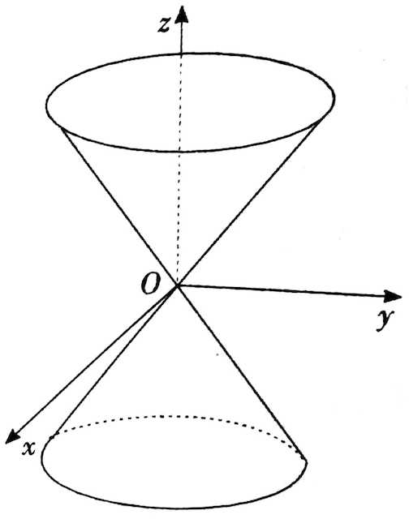

# 空间曲面与曲线

## 旋转面

旋转面是由一条平面曲线绕其平面上的定直线旋转一周所成的曲面，旋转曲线称为旋转面的母线，定直线叫做旋转曲面的轴。

### 旋转面方程

设有 $$xOy$$ 面上的曲线 $$L:\begin{cases} f(x,y)=0\\z=0 \end{cases}$$ ，则曲线 $$L$$ 绕 $$x$$ 轴旋转产生的旋转面方程为 $$f(x,\pm \sqrt{y^2+z^2})=0$$ 

## 柱面

平行于定直线并沿定曲线 $$C$$ 移动的直线 $$L$$ 形成的轨迹叫做柱面，定曲线 $$C$$ 叫做柱面的准线，动直线 $$L$$ 叫做柱面的母线。

### 柱面方程

#### 方法一

准线为 $$L:\begin{cases} F(x,y,z)=0\\G(x,y,z)=0 \end{cases}$$ ，母线的方向向量为 $$\{l,m,n\}$$ 的柱面方程：

先在准线 $$L$$ 上任取一点 $$(x_0,y_0,z_0)$$ ，则过该点的母线方程为 $$\frac{x-x_0}{l}=\frac{y-y_0}{m}=\frac{z-z_0}{n}$$ ，消去方程组 $$\begin{cases} F(x,y,z)=0\\G(x,y,z)=0 \\\frac{x-x_0}{l}=\frac{y-y_0}{m}=\frac{z-z_0}{n}\end{cases}$$ 中的 $$x_0,y_0,z_0$$ 得到关于 $$x,y,z$$ 的方程即为柱面方程。

#### 方法二

准线为 $$L:\begin{cases} x=x(t)\\y=y(t)\\z=z(t) \end{cases}$$ ，母线的方向向量为 $$\{l,m,n\}$$ 的柱面方程：
$$
\begin{cases} x=x(t)+ls\\y=y(t)+ms\\z=z(t)+ns \end{cases}
$$
$$t,s$$ 均为参数。

### 常见柱面

圆柱面：$$x^2+y^2=R^2$$ 

椭圆柱面：$$\frac{x^2}{a^2}+\frac{y^2}{b^2}=1$$ 

抛物柱面：$$y^2=2px$$ 

## 常见的二次曲面

#### 椭球曲面

$$\frac{x^2}{a^2}+\frac{y^2}{b^2}+\frac{z^2}{c^2}=1$$ 

#### 椭圆抛物面

$$\frac{x^2}{a^2}+\frac{y^2}{b^2}=2pz(p>0)$$ 

#### 单叶双曲面

$$\frac{x^2}{a^2}+\frac{y^2}{b^2}-\frac{z^2}{c^2}=1$$ 

#### 双叶双曲面

$$-\frac{x^2}{a^2}-\frac{y^2}{b^2}+\frac{z^2}{c^2}=1$$ 

#### 双曲抛物面

$$\frac{x^2}{a^2}-\frac{y^2}{b^2}=2pz(p>0)$$

#### 二次锥面

$$\frac{x^2}{a^2}+\frac{y^2}{b^2}-\frac{z^2}{c^2}=0$$ 

##  ChangeLog

> 2018.09.17 初稿